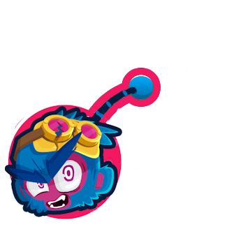

<h1 align="center">

Quantum Entanglement
</h1>

Adds a button to easily link towers together in the style of the 'Quantum Entanglement' bug with Total Transformation from BTD6 v38.

Links will stay even if you save/load the match.

Unlink towers by selecting them through the ability again.

